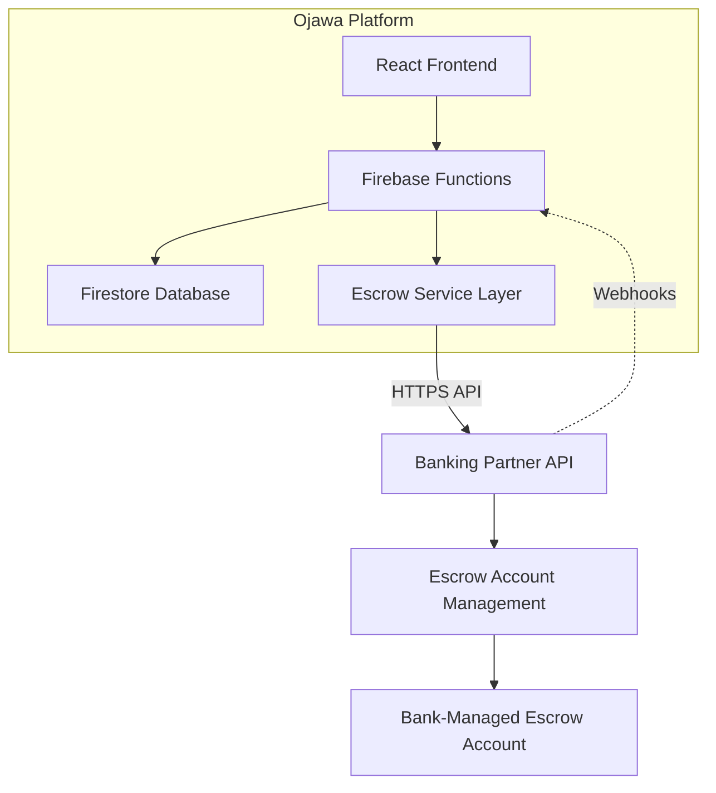
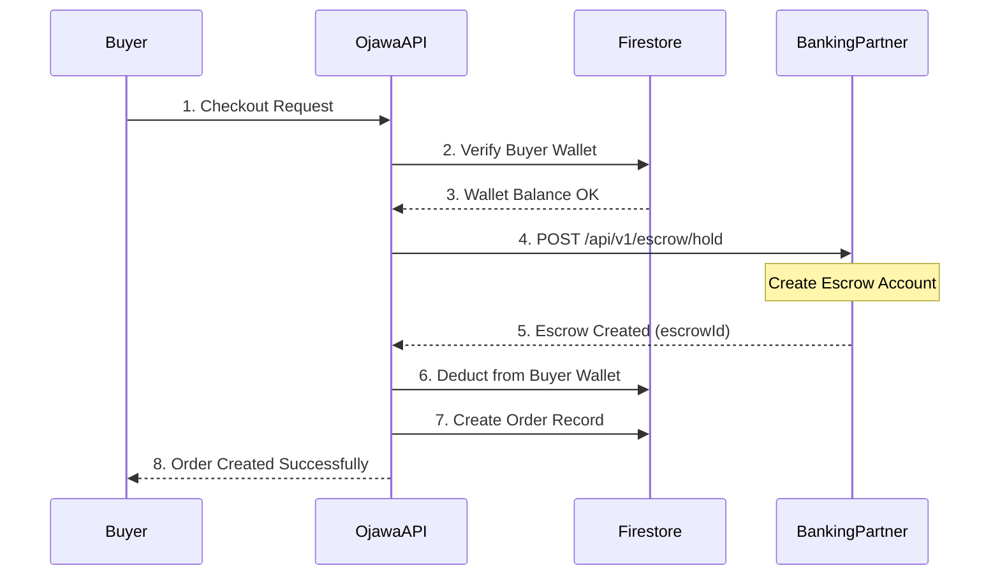
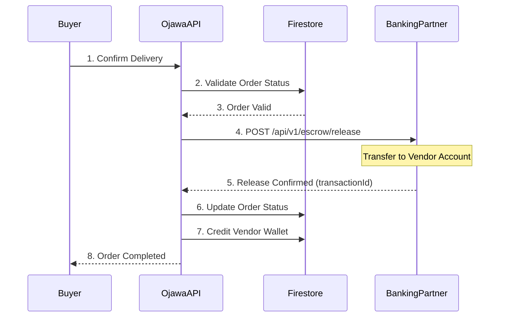
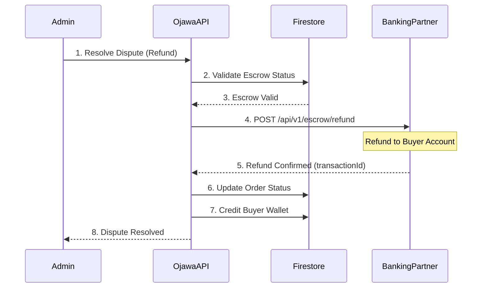
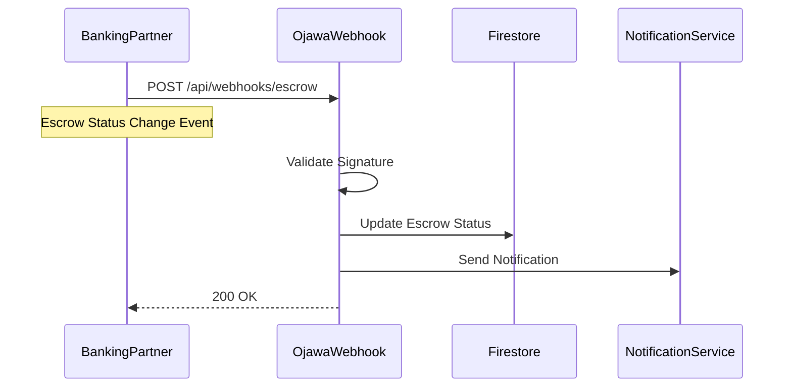
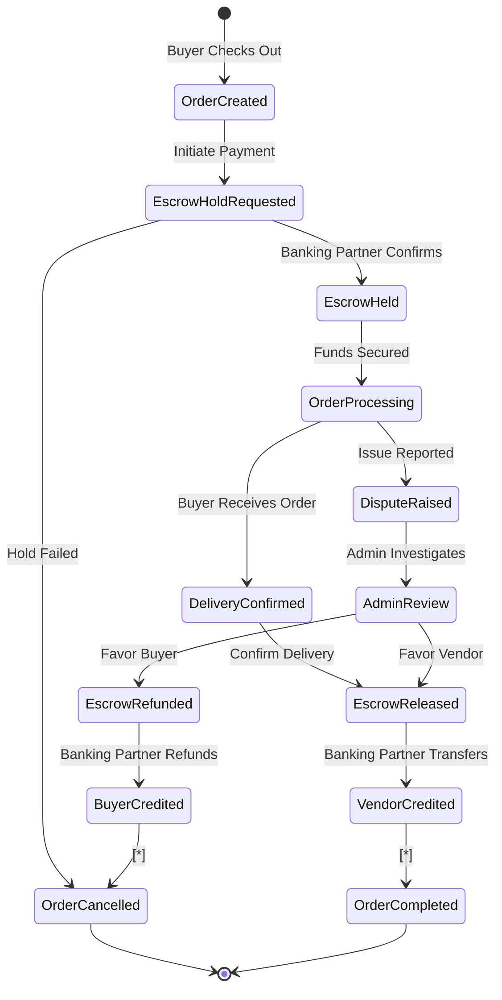
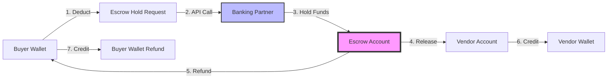
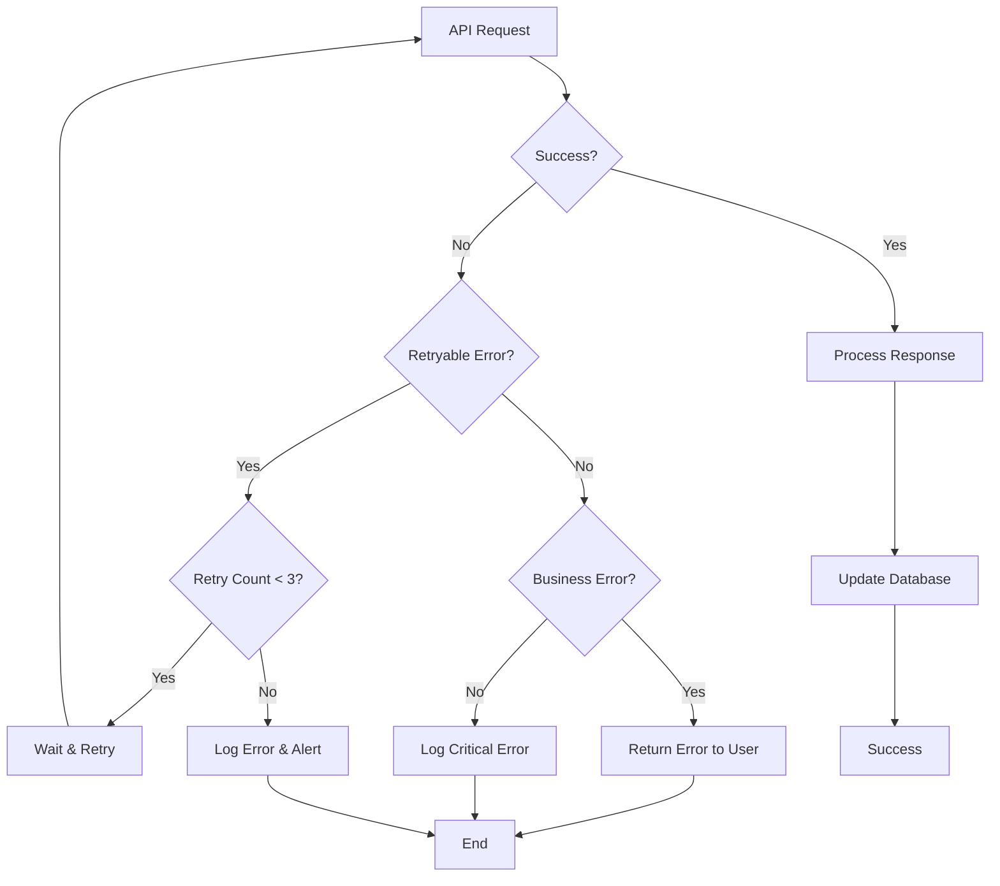
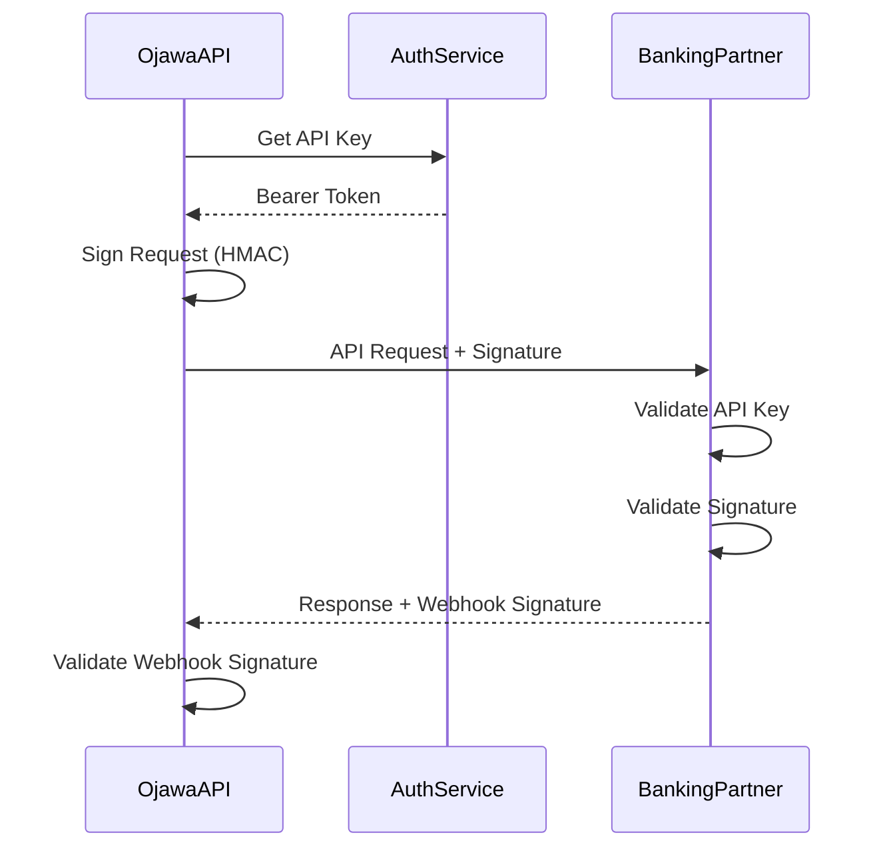

# Escrow Integration - Visual Diagrams

This document contains simplified visual diagrams showing the communication flow between Ojawa and the banking partner.

---

## 1. System Architecture



---

## 2. Order Creation & Escrow Hold Flow



**Key API Call:**
```
POST /api/v1/escrow/hold
{
  "orderId": "ORD-2024-001234",
  "buyerId": "user_buyer_abc123",
  "vendorId": "user_vendor_xyz789",
  "amount": 5000.00,
  "currency": "NGN"
}

Response:
{
  "escrowId": "ESC-2024-001234-567890",
  "status": "held",
  "amount": 5000.00
}
```

---

## 3. Escrow Release Flow (Order Completion)



**Key API Call:**
```
POST /api/v1/escrow/release
{
  "escrowId": "ESC-2024-001234-567890",
  "vendorId": "user_vendor_xyz789",
  "amount": 5000.00
}

Response:
{
  "transactionId": "TXN-2024-001234-RELEASE-789",
  "status": "released"
}
```

---

## 4. Escrow Refund Flow (Dispute Resolution)



**Key API Call:**
```
POST /api/v1/escrow/refund
{
  "escrowId": "ESC-2024-001234-567890",
  "buyerId": "user_buyer_abc123",
  "amount": 5000.00,
  "reason": "Dispute resolved"
}

Response:
{
  "transactionId": "TXN-2024-001234-REFUND-456",
  "status": "refunded"
}
```

---

## 5. Webhook Notification Flow



**Webhook Payload Example:**
```
POST /api/webhooks/escrow
Headers:
  X-Banking-Partner-Signature: {hmac_signature}
  X-Webhook-Event: escrow.released

Body:
{
  "event": "escrow.released",
  "escrowId": "ESC-2024-001234-567890",
  "transactionId": "TXN-789",
  "status": "released"
}
```

---

## 6. Complete Escrow Lifecycle State Machine



---

## 7. API Endpoint Summary Table

| Operation | Method | Ojawa Endpoint | Banking Partner Endpoint | Purpose |
|-----------|--------|----------------|-------------------------|---------|
| Create Escrow | POST | `/api/escrow/create` | `POST /api/v1/escrow/hold` | Hold funds in escrow |
| Release Escrow | POST | `/api/escrow/release` | `POST /api/v1/escrow/release` | Release to vendor |
| Refund Escrow | POST | `/api/escrow/refund` | `POST /api/v1/escrow/refund` | Refund to buyer |
| Query Status | GET | `/api/escrow/{escrowId}` | `GET /api/v1/escrow/{escrowId}` | Get escrow status |
| Webhook | POST | `/api/webhooks/escrow` | - | Receive notifications |

---

## 8. Data Flow Diagram



---

## 9. Error Handling Flow



---

## 10. Security Flow



---

## Quick Reference: Request/Response Examples

### Create Escrow Hold
**Request:**
```json
POST /api/v1/escrow/hold
{
  "orderId": "ORD-2024-001234",
  "buyerId": "user_buyer_abc123",
  "vendorId": "user_vendor_xyz789",
  "amount": 5000.00,
  "currency": "NGN"
}
```

**Response:**
```json
{
  "success": true,
  "escrowId": "ESC-2024-001234-567890",
  "status": "held",
  "amount": 5000.00
}
```

### Release Escrow
**Request:**
```json
POST /api/v1/escrow/release
{
  "escrowId": "ESC-2024-001234-567890",
  "vendorId": "user_vendor_xyz789",
  "amount": 5000.00
}
```

**Response:**
```json
{
  "success": true,
  "transactionId": "TXN-2024-001234-RELEASE-789",
  "status": "released"
}
```

### Refund Escrow
**Request:**
```json
POST /api/v1/escrow/refund
{
  "escrowId": "ESC-2024-001234-567890",
  "buyerId": "user_buyer_abc123",
  "amount": 5000.00
}
```

**Response:**
```json
{
  "success": true,
  "transactionId": "TXN-2024-001234-REFUND-456",
  "status": "refunded"
}
```

---

*These diagrams illustrate the core communication patterns between Ojawa and the banking partner for escrow management.*

